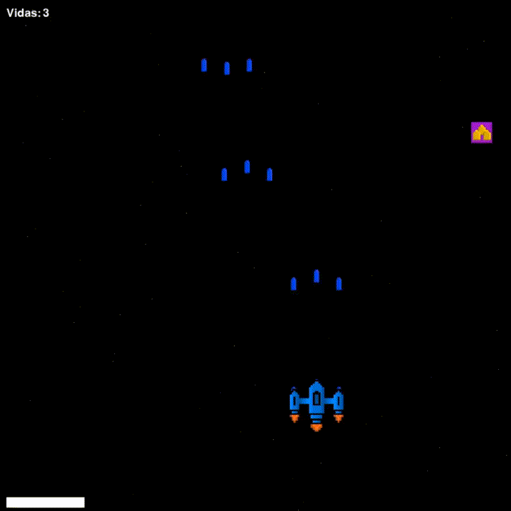

# SpacePy

## Introdução

Desenvolvi uma demo de jogo simples de nave espacial usando Python e Pygame, com o propósito principal de explorar e aprender mecânicas básicas de desenvolvimento de jogos, sem o uso de uma engine.

Neste jogo, o jogador assume uma nave espacial encarregada de se defender contra ondas de inimigos, a mecânica principal envolve movimentar-se para evitar colisões e lançar projéteis às naves inimigas que se aproximam. Além disso, o jogo apresenta power-ups que oferecem vantagens temporárias, como melhorias na velocidade da nave e armas mais poderosas. Além das mecânicas de colisão e partículas, têm também sistema de tela cheia ou janela, resoluções de tela, idioma e outras funções.

## Para Executar o game:

### Linux ambiente virtual python:

    # Instalar a venv python:
    sudo apt install python3-venv
    
    # Criar ambiente virtual:
    python3 -m venv venv
    
    # para ativar:
    source venv/bin/activate

    # Instalar a biblioteca pygame:
    pip3 install pygame

    # para desativar:
    deactivate
