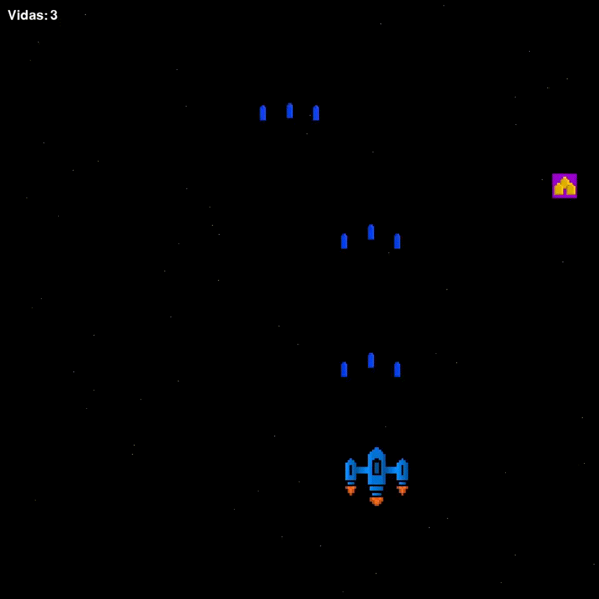

# SpacePy

## Introdução:

Desenvolvi uma demo de jogo simples de nave espacial usando Python e Pygame, com o propósito principal de explorar e aprender mecânicas básicas de desenvolvimento de jogos, sem o uso de uma engine.

Neste jogo, o jogador assume uma nave espacial encarregada de se defender contra ondas de inimigos, a mecânica principal envolve movimentar-se para evitar colisões e lançar projéteis às naves inimigas que se aproximam. Além disso, o jogo apresenta power-ups que oferecem vantagens temporárias, como melhorias na velocidade da nave e armas mais poderosas. Além das mecânicas de colisão e partículas, têm também sistema de tela cheia ou janela, resoluções de tela, idioma e outras funções.

## Para Executar o game:

### Configurando um ambiente virtual python no linux:
    # Instalar a venv python:
    sudo apt install python3-venv
    
    # Criar ambiente virtual:
    python3 -m venv venv
    
    # para ativar:
    source venv/bin/activate
    
    # para desativar:
    deactivate

### Instalando biblioteca pygame:
    # OBS: ative o ambiente virtual, caso queira utilizar ele
    # Instale a biblioteca pygame através do pip3
    pip3 install pygame

### Clone o repositório:
    # Clonar:
    git clone https://github.com/LucasMagalhaes12/spacePy.git

### Executar Game:
    Dentro da pasta spacePy e com o ambiente venv ativado ou com a biblioteca pygame instalada:
    python3 src/main.py
